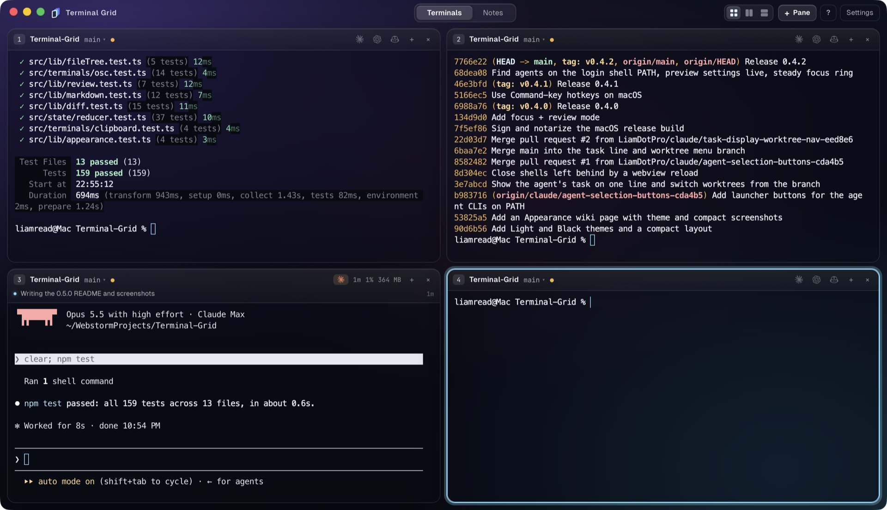
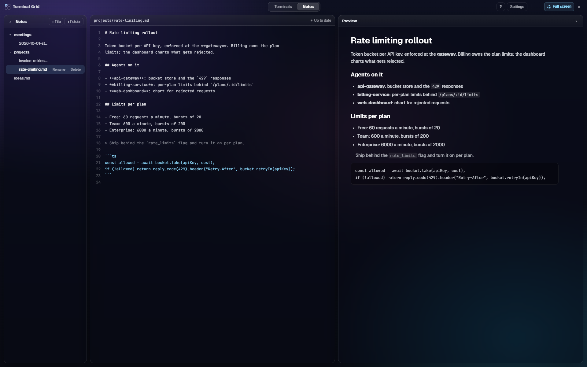

# Terminal Grid

[](https://github.com/LiamDotPro/Terminal-Grid/releases/latest)
[](https://github.com/LiamDotPro/Terminal-Grid/actions/workflows/ci.yml)
[](https://github.com/LiamDotPro/Terminal-Grid/actions/workflows/release.yml)
[](https://github.com/LiamDotPro/Terminal-Grid/releases)

[](https://tauri.app)

A desktop terminal grid for running several coding agents side by side. Every
pane shows its repository and branch, notices when an agent finishes, and can
show the task the agent is working on. A Notes tab keeps markdown next to the
terminals.



- **Grid of terminals** in up to 3x3 per page, side by side or stacked, with as
  many pages as you need.
- **Git aware panes**: repository name and branch in every header, a marker
  when you are in a worktree, and a menu to switch between worktrees.
- **Agent detection**: a pane lights up while Claude Code, Codex, Gemini, Aider
  and friends run, and turns green when they finish.
- **One click launchers**: an idle pane's header has a small button for each
  agent CLI found on your PATH, so only the ones you have installed show.
- **Current task**: agents report what they are doing into a file and the
  pane shows it on one line under the header.
- **Focus + review**: `<mod>+Enter` puts a pane next to its repository's
  staged and unstaged changes. Comment on lines, edit files in place, and send
  the comments to the pane's agent in one go.
- **Notes**: plain `.md` files with a live preview, autosaved.
- **Keyboard first**: everything has a hotkey, hold the modifier to see them.
- **Themes and density**: System, Light, Dark or Black (total darkness), and a
  compact layout with square, borderless panes. See
  [Appearance](docs/wiki/Appearance.md).



## What's new in 0.4.1

- **Mac hotkeys.** macOS now uses the Command key the way Mac apps do: `⌘N`,
  `⌘T`, `⌘W`, `⌘1…9`, `⌥⌘` arrows, `⌘↩`, `⌃Tab`, `⌘,`. Option and Control are
  left to the shell, and every shortcut in the app is written with Mac symbols.
  See [Hotkeys](#hotkeys).
- **`⌘W` closes a pane, not the app.** The macOS menu no longer claims it for
  Close Window.

## What's new in 0.4.0

- **Focus + review.** `<mod>+Enter` collapses the grid to the focused pane and
  a review panel for its repository: staged and unstaged files, a diff with
  three lines of context or the whole file with an overview strip, and line
  comments on staged files. **Request changes** sends the pending comments,
  with an optional note, to the pane's agent. The other panes stay one click
  away as numbered pills in the bar. See [Focus + review](#focus--review).
- **Edit in place.** The review panel's Edit mode opens the file on disk with
  added, modified and unsaved lines marked in the gutter; saving writes it
  back as an unstaged change.
- **Light and Black themes, and a compact layout** with square, borderless
  panes. See [Appearance](docs/wiki/Appearance.md).
- **Agent launchers.** An idle pane's header has a button for each agent CLI
  found on your PATH.
- **Task line and worktree menu.** A reported task shows on one line under the
  header, and the branch opens a menu to move between worktrees.
- **Signed and notarized macOS build**, so Gatekeeper opens it without a
  workaround.
- Shells left running by a webview reload are closed.

## Install

Download the latest build from the
[Releases page](https://github.com/LiamDotPro/Terminal-Grid/releases/latest).

### Windows

- `Terminal.Grid_<version>_x64-setup.exe` installs per user with no admin prompt
  (recommended).
- `Terminal.Grid_<version>_x64_en-US.msi` is the MSI for scripted or per machine
  installs.

Both bootstrap the WebView2 runtime if it is missing. Windows 10 1809 or later
is required for ConPTY.

### macOS

`Terminal.Grid_<version>_universal.dmg` runs natively on Apple Silicon and
Intel. The build is not notarized yet, so after dragging the
app to Applications run this once if macOS reports it as damaged:

```
xattr -cr "/Applications/Terminal Grid.app"
```

### Linux

- `Terminal.Grid_<version>_amd64.AppImage` runs on most distributions:
  `chmod +x` it and start it.
- `Terminal.Grid_<version>_amd64.deb` for Debian and Ubuntu
  (`sudo apt install ./Terminal.Grid_*.deb`).
- `Terminal.Grid-<version>-1.x86_64.rpm` for Fedora and openSUSE.

The app uses WebKitGTK 4.1, which the packages pull in as a dependency.

## Documentation

More guides live in the [docs wiki](docs/wiki/Home.md), starting with
[Appearance](docs/wiki/Appearance.md) for themes and the compact layout.

## Shells

On Windows the app starts `pwsh`, then Windows PowerShell, then `%COMSPEC%`. On
macOS and Linux it starts `$SHELL`, falling back to `/bin/bash`. A different
shell and its arguments can be set in Settings.

PowerShell, bash and zsh get a small integration script
(`src-tauri/resources/`) that reports the working directory and command
boundaries, so labels follow `cd` and finished agents are noticed straight
away. Other shells work too; they just rely on process detection alone.

## Build prerequisites

All platforms need Rust stable and Node 22, plus Git on `PATH`.

- **Windows**: the MSVC toolchain (`rustup default stable-msvc`) and Visual
  Studio Build Tools with the "Desktop development with C++" workload.
- **macOS**: Xcode Command Line Tools (`xcode-select --install`).
- **Linux** (Debian/Ubuntu):
  `sudo apt install libwebkit2gtk-4.1-dev libappindicator3-dev librsvg2-dev patchelf`

## Run

```
npm install
npm run tauri dev
```

The window is frameless and starts fullscreen; the 44px bar at the top is the
app's own chrome, and it is the drag region. `F11` toggles fullscreen. While
fullscreen the maximize button is replaced by a highlighted "Full screen" pill
that exits it; a normal window has a thin outline and resizes from its edges.

## Build installers

```
npm run tauri build
```

Output lands in `src-tauri/target/release/bundle/`, one folder per format
(`nsis` and `msi` on Windows, `dmg` and `macos` on macOS, `appimage`, `deb` and
`rpm` on Linux).

## Release

Bump the version in `package.json`, `src-tauri/Cargo.toml` and
`src-tauri/tauri.conf.json`, commit, then push an annotated tag. The tag
message becomes the top of the release notes, so keep it to a few short lines
about what changed:

```
git tag -a v0.4.0 -m "Terminal Grid 0.4.0" -m "- Focus + review"
git push origin v0.4.0
```

[`release.yml`](.github/workflows/release.yml) then:

1. creates a draft release from the tag message,
2. runs the tests and builds Windows, macOS (universal) and Linux in parallel,
   uploading each platform's installers into the draft,
3. publishes the release once every platform succeeded.

If one platform fails the draft stays unpublished; re-run the failed job from
the Actions tab and it publishes when that passes. "Run workflow" on the same
workflow builds every platform without releasing. Pushes and pull requests run
[`ci.yml`](.github/workflows/ci.yml): the tests and frontend build on all three
platforms.

The macOS app is signed with a Developer ID certificate and notarized when the
`APPLE_*` repository secrets are set; `docs/macos-signing.md` covers the
certificate, the secrets and how to test it.

Microsoft Store submission (MSIX via `scripts/pack-msix.ps1`) and the Mac App
Store assessment are in `docs/store-publishing.md`.

## Test

```
npm test                 # frontend: layout, hotkeys, OSC parsing, markdown, diff, reducer
cd src-tauri && cargo test   # core: worktree parser, review status, path sandbox, agent state, coalescer
```

## Layout

```
docs/                    design docs and README screenshots
src/                     frontend (Vite + React 19 + xterm.js)
  ipc/                   the IPC contract and typed client — the boundary
  state/                 reducer, view models, the provider that talks to Rust
  terminals/             xterm instance registry, theme, OSC parsing
  components/            chrome, pane grid, review panel, notes, settings
  styles/                design tokens and component CSS
src-tauri/               Rust core, see docs/technical-design.md section 2
```

- Design doc: `docs/technical-design.md`
- IPC contract shared by both sides: `src/ipc/types.ts`

## Hotkeys

Windows and Linux chord on a modifier, `Ctrl+Alt` by default, switchable to
`Ctrl+Shift` in Settings (AltGr layouts make `Ctrl+Alt` awkward on some
keyboards). macOS uses the Command key the way Mac apps do; ⌘ never reaches the
shell, so none of these take a key from the terminal, and Option is left alone
for moving by word.

| Windows / Linux | macOS | Action |
|---|---|---|
| `<mod>+N` | `⌘N` | New pane (folder picker), placed after the focused pane |
| `<mod>+Shift+N` | `⌘T` | New pane in the focused pane's folder |
| `<mod>+L` | `⌘L` | Cycle pane stacking: grid, side by side, stacked |
| `<mod>+W` | `⌘W` | Close pane (confirms while an agent is running) |
| `<mod>+R` | `⌘R` | Restart the shell in the focused pane |
| `<mod>+←↑↓→` | `⌃⌘←↑↓→` | Move the focused pane |
| `Alt+←↑↓→` or `<mod>+Shift+←↑↓→` | `⌥⌘←↑↓→` | Focus the neighbouring pane in that direction |
| `<mod>+1…9` | `⌘1…9` | Focus pane n on the current page |
| `<mod>+[` / `<mod>+]` | `⇧⌘[` / `⇧⌘]` | Previous / next page (`PageUp` / `PageDown`, and `⌘[` / `⌘]`, also work) |
| `<mod>+Enter` | `⌘↩` | Focus + review the focused pane, and back to the grid |
| `<mod>+Tab` | `⌃Tab` | Switch between Terminals and Notes (`<mod>+T` / `<mod>+M` also work) |
| `<mod>+B` / `<mod>+P` | `⌘B` / `⌘P` | Notes: hide or show the notes list / the preview |
| `<mod>+,` | `⌘,` | Settings |
| `F11` | `⌃⌘F` | Toggle full screen |

With `Ctrl+Shift` as the modifier, `Alt` takes the place of `Shift` above.
Holding the modifier (`⌘` on a Mac) for a moment shows the same list as a
popover. On macOS the clipboard is `⌘C` / `⌘V` and every `Ctrl` key goes to the
shell; elsewhere `Ctrl+C` copies while text is selected and `Ctrl+V` pastes.

## Focus + review

`<mod>+Enter` (or `<mod>+Enter` again to go back) lifts the focused pane out of
the grid and puts a review panel for its repository next to it. The other
panes on the page become numbered pills in the bar; a green dot means that
pane's agent finished. Click a pill, or use `<mod>+1…9`, to review another
pane.

The panel lists `git status` as **Staged** and **Unstaged**, with buttons to
stage or unstage a file or everything. Only staged files take comments: click
a line number, or press `C`, write the comment and press `Ctrl+Enter` (`⌘↩`).
Comments stay **Pending** across files until **Request changes** sends them,
with an optional note, to the pane's agent as one message; then they are
marked **Sent**. When the agent commits, the committed files leave the list
and their comments go with them.

| Key | In the panel |
|---|---|
| `↑` / `↓` | Previous / next file |
| `N` / `Shift+N` | Next / previous change |
| `F` | Changes only (3 lines of context) or the whole file, with an overview strip |
| `E` | Edit the file on disk; `Ctrl+S` (`⌘S`) saves, `Esc` hands the keys back |
| `C` | Comment on the current line |

Edit mode marks added (green), modified (amber) and your unsaved (cyan) lines
in the gutter, and removed lines as red markers. Saving writes the file to
disk, so on a staged file the edit shows up as an unstaged change on top.
Unsaved edits survive switching files; a file changed on disk while you edit
asks whether to reload or keep yours.

## Stacking and opening panes from a pane

The three-way switch in the top bar (or `<mod>+L`) chooses how the panes on a
page stack: **grid** (both directions, the responsive 1 to 3x3 table),
**side by side** (one row, horizontal) or **stacked** (one column, vertical).
The choice is remembered in the session. In the single-direction modes the
arrow hotkeys only move along that direction.

Every pane header has a `+` button. Clicking it opens a menu to start a new
pane in the same folder or pick another one; `Shift`+click goes straight to
the folder picker. Either way the new pane lands directly after the pane it
was opened from, not at the end of the last page.

## Clipboard

The terminals use the system shortcuts: `Ctrl+V` or `Shift+Insert` pastes,
`Ctrl+C` copies while text is selected (and interrupts otherwise, as usual),
and `Ctrl+Insert` copies. Shells that enable bracketed paste get the text
wrapped accordingly.

## Agent detection

A pane is marked as running an agent when a process below its shell matches one
of the configured name patterns (Settings → Agent name patterns), matched
against the full command line so Claude Code's `node` process is recognised.
When that process goes away the pane gets a green border and a `finished`
marker, cleared as soon as you look at the pane. Shell integration (`OSC 133`)
and the terminal bell are used as secondary signals; duplicates within five
seconds are ignored.

To get the bell signal from Claude Code in addition to process detection:

```
claude config set --global preferredNotifChannel terminal_bell
```

## Current task

Once an agent reports its task, the task shows on one line under the pane
header, with how long ago it came in. Click the line for the full text and an
**Ask for an update** button. Until the first report, the header shows a small
`task` button instead.

Every shell starts with `TERMINAL_GRID_TASK_FILE` pointing at a file for that
pane. Anything written there shows up in the header within a second, and
emptying the file clears it:

```
echo "Adding retries to the upload client" > "$TERMINAL_GRID_TASK_FILE"
```

Agents don't know about this on their own. You can tell them in two ways:

- **Ask agent** behind the `task` button types a one line request into the
  pane, so the agent writes its task now.
- **Copy instructions** copies a short section for `CLAUDE.md` or `AGENTS.md`,
  so the agent keeps the file up to date without being asked.

## Worktrees

A small fork icon in front of the branch means the pane is in a linked git
worktree, not the main checkout. When the repo has more than one worktree, the
branch gets a `▾` and opens a list of them:

- At a shell prompt, picking one types a `cd` into the pane.
- If another pane already has that worktree open, picking it jumps to that pane.
- While an agent runs in the pane, picking one opens a new pane there instead,
  so nothing is typed into the agent.
- Shift+click always opens a new pane.

## Notes

Plain `.md` files under a folder you choose (default `TerminalGrid/Notes` in
your Documents folder). The editor autosaves 600 ms after the last keystroke
and on blur; writes are atomic and guarded by the file's modification time, so
an edit made outside the app raises a reload/keep prompt instead of being
overwritten. Deleting moves the file to the system trash.

The notes list on the left and the preview on the right each fold away with
the chevron in their header; the editor in the middle always stays and takes
the freed width. A folded panel becomes a slim rail at its edge; click the rail
(or use `<mod>+B` / `<mod>+P`) to bring it back. Both choices are remembered
in the session.
