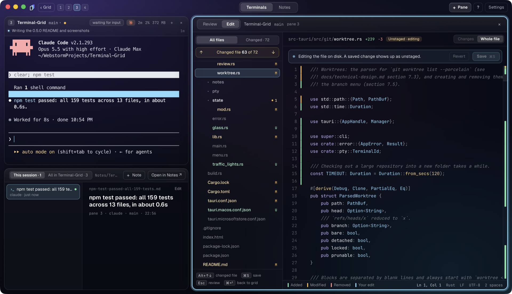
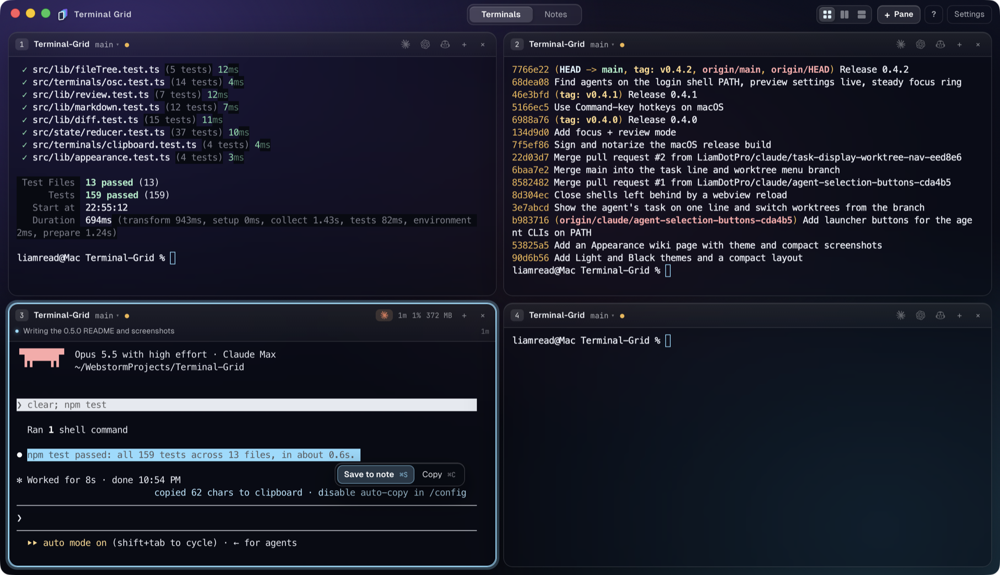

# Terminal Grid

[](https://github.com/LiamDotPro/Terminal-Grid/releases/latest)
[](https://github.com/LiamDotPro/Terminal-Grid/actions/workflows/ci.yml)
[](https://github.com/LiamDotPro/Terminal-Grid/actions/workflows/release.yml)
[](https://github.com/LiamDotPro/Terminal-Grid/releases)

[](https://tauri.app)

A desktop terminal grid for running several coding agents side by side. Every
pane shows its repository and branch, notices when an agent finishes, and can
show the task the agent is working on. Notes sit next to the terminals.


- **Grid of terminals**: up to 3x3 per page, side by side or stacked, as many
  pages as you need, resized by dragging the gaps.
- **Git aware panes**: repository and branch in every header, and a menu to
  switch, create and remove worktrees.
- **Agent detection**: a pane lights up while Claude Code, Codex, Gemini, Aider
  and friends run, and turns green when they finish.
- **Launchers**: an idle pane offers a button for each agent CLI on your PATH.
- **Current task**: agents write what they are doing to a file; the pane shows
  it under the header.
- **Focus + review**: put a pane next to its repository's changes, comment on
  lines, edit any file, and send the comments to the agent in one go.
- **Notes**: save a terminal selection as a markdown note linked to its
  session, or write your own; autosaved, with a live preview.
- **Keyboard first**: everything has a hotkey; hold the modifier to see them.
- **Themes**: System, Light, Dark, Black and, on macOS, Glass, a compact
  layout, and your own focus ring colour. See
  [Appearance](docs/wiki/Appearance.md).


## What's new in 0.5.0

- **Save to note.** Release a selection in a terminal for **Save to note** and
  **Copy**, or press `<mod>+S` (`⌘S`). Works on text selected inside Claude
  Code too, and offers an **Undo**.
- **Notes under the terminal** in focus mode: this session's notes, or every
  note for the repository, with **+ Note** to start one.
- **Edit any file.** Edit mode shows the whole repository as a tree, with
  changed files marked and `Alt+↑` / `Alt+↓` to step through them.
- **Create and remove worktrees** from the branch menu.
- **Resizable panes**: drag the gap between panes, double-click to even out.
- **Your colours**: pick the focus ring and agent finished colours in
  Settings.
- **Glass theme** and native traffic lights on macOS, a new app icon and a
  launch animation, and agent logos on the launchers.
- Task lists (`- [x]`) show as checkboxes in the note preview, and choosing
  **Auto** for the shell in Settings now sticks.

Earlier changes are on the
[Releases page](https://github.com/LiamDotPro/Terminal-Grid/releases).

## Install

Download the latest build from the
[Releases page](https://github.com/LiamDotPro/Terminal-Grid/releases/latest).

- **Windows** (10 1809 or later): `…_x64-setup.exe` installs per user without
  an admin prompt; `…_x64_en-US.msi` is for scripted or per machine installs.
  Both install WebView2 if it is missing.
- **macOS**: `…_universal.dmg`, signed and notarized, native on Apple Silicon
  and Intel.
- **Linux**: `…_amd64.AppImage` (`chmod +x` and run), `…_amd64.deb`
  (`sudo apt install ./Terminal.Grid_*.deb`) or `…x86_64.rpm`. Needs
  WebKitGTK 4.1, which the packages pull in.

On Windows the app starts `pwsh`, then Windows PowerShell, then `%COMSPEC%`;
elsewhere `$SHELL`, then `/bin/bash`. Settings can name another shell.
PowerShell, bash and zsh get a small integration script
(`src-tauri/resources/`) so labels follow `cd` and finished agents are noticed
straight away; other shells rely on process detection.

More guides are in the [docs wiki](docs/wiki/Home.md).

## Hotkeys

Windows and Linux chord on `Ctrl+Alt`, or `Ctrl+Shift` if you pick it in
Settings (then `Alt` replaces `Shift` below). macOS uses ⌘, which never reaches
the shell. Hold the modifier to see this list in the app.

| Windows / Linux | macOS | Action |
|---|---|---|
| `<mod>+N` | `⌘N` | New pane (folder picker) after the focused one |
| `<mod>+Shift+N` | `⌘T` | New pane in the focused pane's folder |
| `<mod>+L` | `⌘L` | Cycle stacking: grid, side by side, stacked |
| `<mod>+W` | `⌘W` | Close pane (confirms while an agent runs) |
| `<mod>+R` | `⌘R` | Restart the shell |
| `<mod>+←↑↓→` | `⌃⌘←↑↓→` | Move the focused pane |
| `Alt+←↑↓→` | `⌥⌘←↑↓→` | Focus the neighbouring pane |
| `<mod>+1…9` | `⌘1…9` | Focus pane n on the page |
| `<mod>+[` / `]` | `⇧⌘[` / `]` | Previous / next page (also `PageUp` / `PageDown`) |
| `<mod>+Enter` | `⌘↩` | Focus + review, and back |
| `<mod>+S` | `⌘S` | Save the selection as a note |
| `<mod>+Tab` | `⌃Tab` | Terminals / Notes |
| `<mod>+B` / `P` | `⌘B` / `P` | Notes: toggle the list / the preview |
| `<mod>+,` | `⌘,` | Settings |
| `F11` | `⌃⌘F` | Full screen |

Copy and paste are the system's: `⌘C` / `⌘V` on macOS; elsewhere `Ctrl+C`
copies while text is selected, `Ctrl+V` or `Shift+Insert` pastes.

## Panes

The switch in the top bar (or `<mod>+L`) stacks a page as a **grid**, **side
by side** or **stacked**. Drag the gap between two panes to resize them;
double-click it to even them out. A pane's `+` button opens a new pane in the
same folder or another one, right after it.

**Agents.** A pane counts as running an agent while a process under its shell
matches one of the name patterns in Settings. When it exits the pane turns
green until you look at it. Shell integration (`OSC 133`) and the bell are
extra signals; for Claude Code's bell run
`claude config set --global preferredNotifChannel terminal_bell`.

**Current task.** Every shell gets `TERMINAL_GRID_TASK_FILE`; whatever is
written there shows under the header within a second:

```
echo "Adding retries to the upload client" > "$TERMINAL_GRID_TASK_FILE"
```

The `task` button can **Ask agent** to write it now, or **Copy instructions**
for `CLAUDE.md` / `AGENTS.md` so the agent keeps it up to date.

**Worktrees.** A fork icon before the branch marks a linked worktree. The
branch opens the repository's worktrees: picking one `cd`s the pane there,
jumps to a pane already in it, or opens a new pane while an agent runs
(Shift+click always does). **New worktree…** creates one next to the main
checkout (`feature/x` in `app` → `../app-feature-x`), checking out an existing
branch or branching from `HEAD`. Unused linked worktrees can be removed; the
branch stays.

## Focus + review



`<mod>+Enter` puts the focused pane next to a review panel for its repository;
the other panes become numbered pills in the bar. The panel lists **Staged**
and **Unstaged** files with stage and unstage buttons. Comment on a staged
line (click its number or press `C`, then `Ctrl+Enter` / `⌘↩`), and **Request
changes** sends every pending comment, with an optional note, to the agent.

| Key | In the panel |
|---|---|
| `↑` / `↓` | Previous / next file |
| `N` / `Shift+N` | Next / previous change |
| `F` | Changes only or the whole file |
| `E` | Edit mode; `Ctrl+S` (`⌘S`) saves, `Esc` hands the keys back |
| `C` | Comment on the current line |

Edit mode shows the whole repository as a tree (**All files** or
**Changed**), opens any file over the copy on disk and marks added, modified
and unsaved lines in the gutter. `Alt+↑` / `Alt+↓` step through changed files.
A file changed on disk while you edit asks whether to reload or keep yours.

## Notes



Plain `.md` files in a folder you choose (default `Documents/TerminalGrid/Notes`),
autosaved, with a reload/keep prompt if a file changes outside the app.
Deleting moves a file to the trash. `<mod>+B` / `<mod>+P` fold the list and
the preview.

Releasing a selection in a terminal, Claude Code's own selection included,
offers **Save to note** and **Copy**. A saved note goes to `<repo>/` in the
notes folder, titled from its first line and linked to the pane's session,
with an **Undo** for a few seconds. In focus mode the notes appear below the
terminal: **This session**, or **All in** *repo* including notes written by
hand with **+ Note**.

## Development

Needs Rust stable, Node 22 and Git, plus:

- **Windows**: `rustup default stable-msvc` and Visual Studio Build Tools
  ("Desktop development with C++").
- **macOS**: `xcode-select --install`.
- **Linux** (Debian/Ubuntu):
  `sudo apt install libwebkit2gtk-4.1-dev libappindicator3-dev librsvg2-dev patchelf`

```
npm install
npm run tauri dev            # run
npm run tauri build          # installers in src-tauri/target/release/bundle/
npm test                     # frontend tests
cd src-tauri && cargo test   # Rust tests
```

`src/` is the frontend (Vite, React 19, xterm.js), `src-tauri/` the Rust core.
The design is in `docs/technical-design.md` and the IPC contract between the
two in `src/ipc/types.ts`.

### Release

Bump the version in `package.json`, `src-tauri/Cargo.toml` and
`src-tauri/tauri.conf.json`, commit, and push an annotated tag; its message
heads the release notes:

```
git tag -a v0.5.0 -m "Terminal Grid 0.5.0" -m "- Save to note"
git push origin v0.5.0
```

[`release.yml`](.github/workflows/release.yml) drafts the release, builds every
platform in parallel and publishes once all succeed; re-run a failed job and
it publishes when that passes. [`ci.yml`](.github/workflows/ci.yml) tests
every push and pull request. macOS signing is in `docs/macos-signing.md`,
store publishing in `docs/store-publishing.md`.
