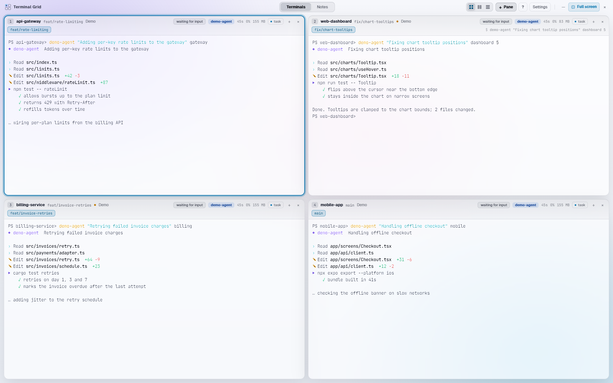
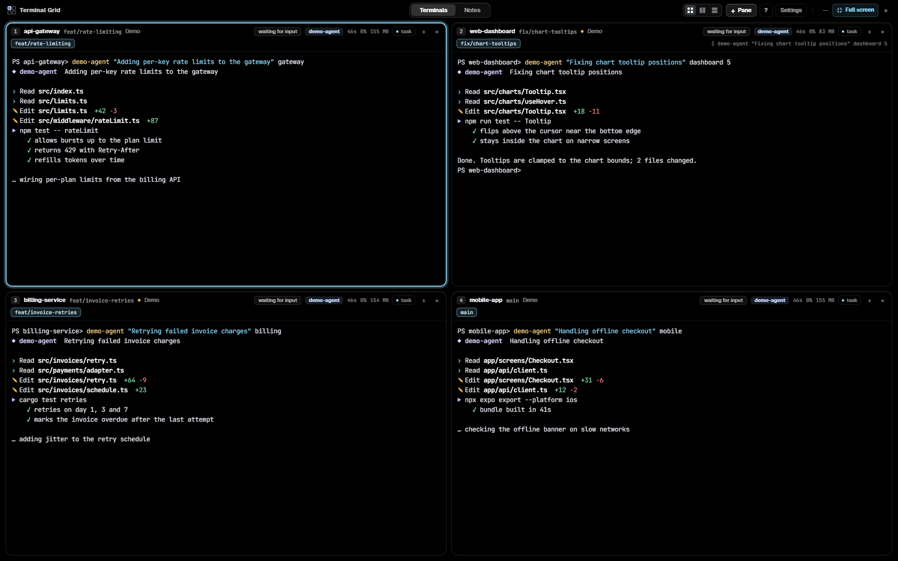
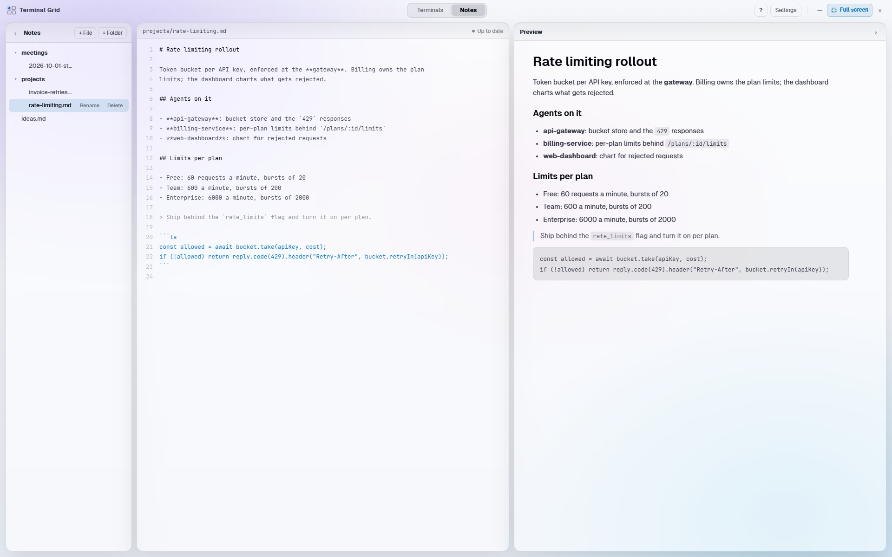
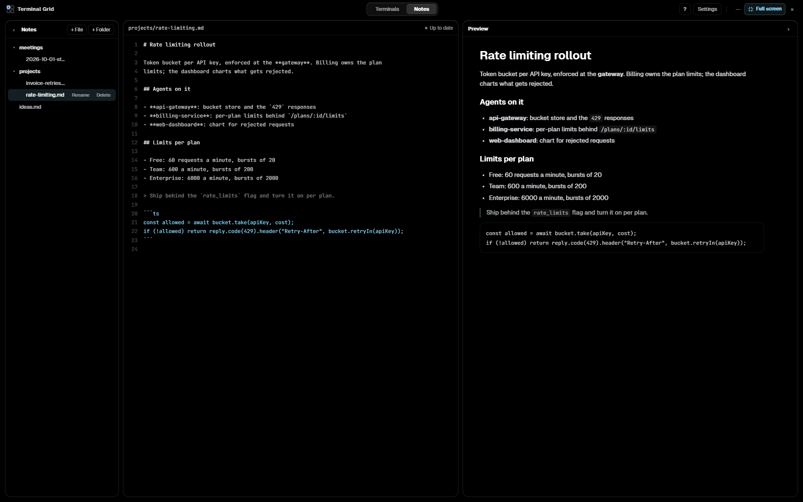
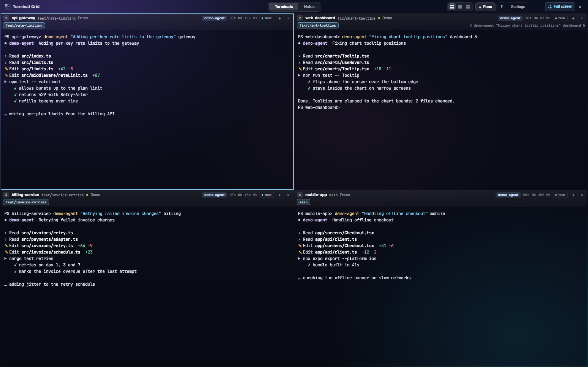
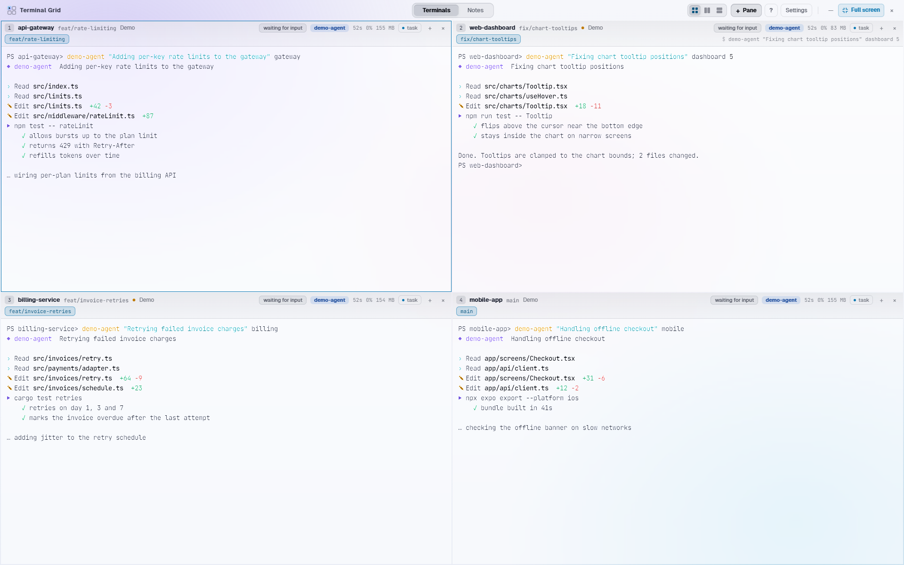

# Appearance

Three settings change how Terminal Grid looks: **Theme**, **Compact layout**
and **Colours**. They are in **Settings** (`<mod>+,`, `⌘,` on a Mac), preview
as you change them, and stick when you press Save; Cancel puts them back.

## Themes

| Theme | What it does |
|---|---|
| **System** (default) | Follows your operating system's light or dark setting, and switches live when the OS does. |
| **Light** | Frosted white panes on a pale background, with deeper accent colours so text and badges keep their contrast. |
| **Dark** | The original look: frosted dark glass over a violet and teal glow. |
| **Black** | Total darkness: pure black background, no coloured glow, no shadows and near opaque panes. Good for OLED screens and dark rooms. |
| **Glass** (macOS) | The window turns see-through: your desktop shows through it, blurred. In full screen there is nothing behind the window, so it shows as Dark. |

The terminals follow the theme too. Light uses a darker ANSI palette so program
output stays readable on white; Dark and Black share the bright palette.

### Dark

### Light

### Black

### Notes

The Notes tab follows the theme as well: the editor, the list and the
rendered preview.

## Compact layout

Compact layout fits more terminal into the window:

- panes are square, with no rounded corners
- no pane borders or drop shadows
- 2px between panes and between the panes and the window edge
- slimmer pane headers

The focused pane and a pane whose agent just finished still stand out: they get
a 1px outline drawn inside the pane, so it takes no extra space. The Notes tab
uses the same spacing and square panels.

Compact layout works with every theme.

### Compact, Dark

### Compact, Light

## Colours

**Focus ring** sets the colour of the ring around the focused pane (and the
review panel in focus mode); **Agent finished** sets the green of a pane whose
agent just finished. Click a swatch to open the system colour picker. Until you
pick one, each follows the theme; **Reset** goes back to the theme's colour.

## Where the settings are stored

They live in `config.json` in the app's config folder, as `theme` (`"system"`,
`"light"`, `"dark"`, `"black"` or `"glass"`), `compactLayout` (`true` or
`false`), and `focusColor` / `finishedColor` (`"#rrggbb"`, or `null` for the
theme's colour).
Config files from before these settings existed keep all their other values
and start on System with the regular layout.
